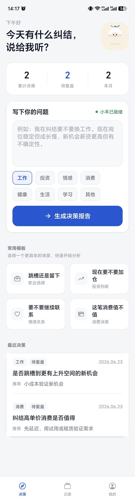
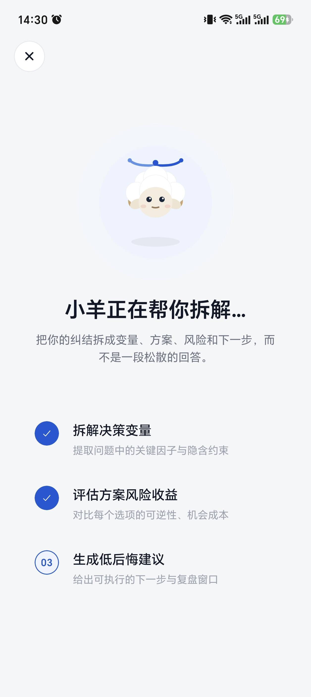
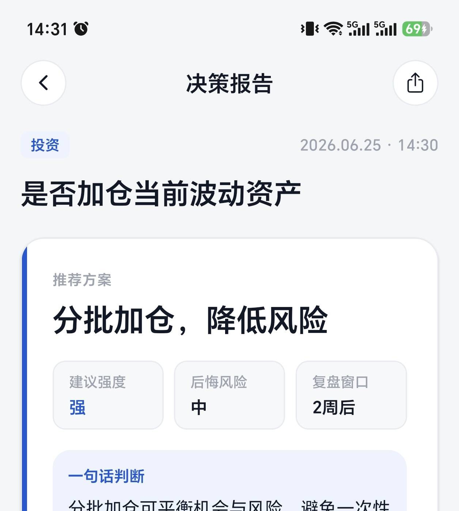
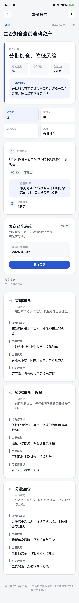
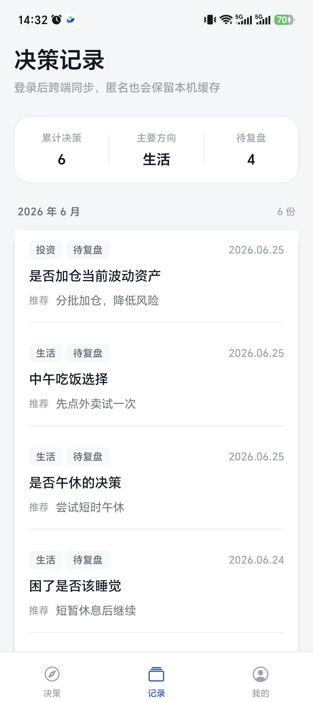
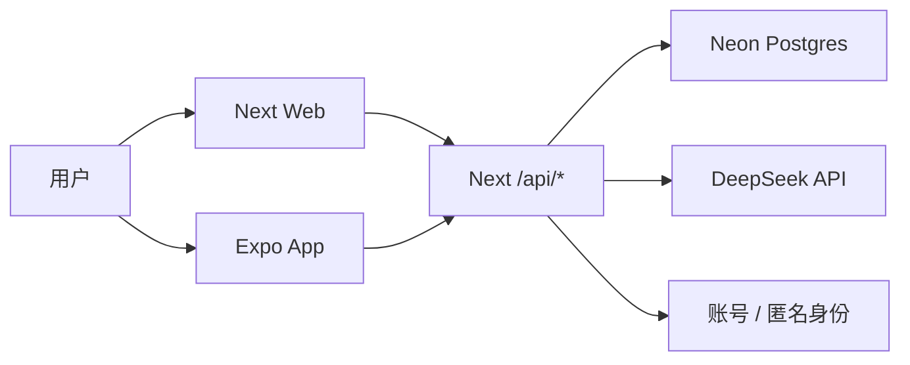

# 决策助手 Decision Assistant

一个带“小羊暖外壳”的 AI 决策工具：用户随手写下纠结，系统把它拆成选项、风险、低后悔行动，并在事后复盘沉淀个人决策画像。

- 在线体验：https://decision.koocuu.com/
- 当前定位：作品集 / 简历展示 / 朋友体验
- 核心闭环：输入纠结 → AI 拆解 → 决策报告 → 复盘 → 个人画像
- Android 展示包：线上首页可扫码或点击按钮下载

## Web + App 高光截图

| Web 首页 | App 首页 |
|---|---|
|  |  |

| App 生成中 | App 报告页 |
|---|---|
|  |  |

<details>
<summary>完整报告长图和更多移动端截图</summary>





</details>

## 技术栈

- Web：Next.js App Router、React、Tailwind CSS
- App：Expo SDK 54、Expo Router、React Native SVG
- 数据库：Neon Postgres + Prisma
- AI：DeepSeek，经 Next/Vercel 服务端代理
- 账号：邮箱密码登录、httpOnly cookie、App Bearer token、匿名 `anonId`
- 部署：Vercel

## 架构简图



关键边界：

- DeepSeek key 只在服务端环境变量中出现。
- Expo App 不直连 Neon，不保存 AI key，只调用同一套 `/api/*`。
- Web 使用 cookie session；App 使用 Bearer token + SecureStore。
- 匿名用户也能完整生成报告，登录后匿名数据 claim 到账号。

## 本地运行

```powershell
npm install
npm run prisma:generate
npm run dev
```

移动端：

```powershell
cd apps/mobile
npm install
npm run start
```

需要的本地环境变量见 `.env.example`。真实 `.env` 不要提交。

## 验证命令

```powershell
npm run lint
npm run build
```

移动端：

```powershell
cd apps/mobile
npm run typecheck
```

## 项目文档

- [产品文档](docs/产品文档.md)：产品定位、目标用户、核心流程。
- [架构文档](docs/架构文档.md)：Next Web + Expo App + shared core 的边界。
- [产品/技术复盘](docs/复盘.md)：面试讲故事用的一页复盘。
- [进度账本](docs/进度账本.md)：当前状态、已完成、下一步。
- [作品打磨需求](docs/作品打磨需求.md)：小羊、动效、截图和下载入口的收口标准。

## 作品状态

已完成：

- Web 账号体系与用户/匿名数据隔离
- AI 生成、报告、复盘、画像闭环
- Expo App 账号同步与服务端历史读取
- Web/移动端小羊四态角色系统
- Android APK 下载入口

暂不做：

- App Store 上架
- OG 大图、analytics、重测试体系
- 大规模增长和商业化验证
