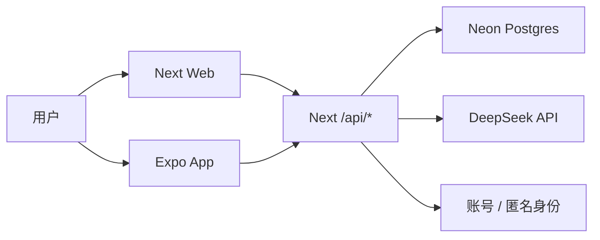

# 决策助手 Decision Assistant

一个带“小羊暖外壳”的 AI 决策工具：用户随手写下纠结，系统把它拆成选项、风险、低后悔行动，并在事后复盘沉淀个人决策画像。

当前定位：作品集 / 简历展示 / 给朋友体验。重点不是重押增长，而是展示一个完整、可上线、可跨端复用的 AI 产品闭环。


## 在线体验
- https://decision.koocuu.com/
- Web：部署在 Vercel，承载 PC Web、移动 Web、账号体系和 AI API。
- Android App：网页首页提供 APK 下载入口和二维码，指向 `/api/download/android`。

## 产品亮点

- 低门槛输入：用户只需要写一句“我在纠结什么”。
- AI 结构化：自动拆成背景、选项、情绪、风险和低后悔行动。
- 复盘闭环：不是生成完就结束，而是记录结果、后悔分和下次策略。
- 个人画像：复盘后沉淀常见场景、纠结点和低后悔策略。
- 小羊角色系统：温暖但克制的陪伴感，覆盖 idle / thinking / happy / celebrate 四种状态。
- Web + Expo：Next.js 负责 Web/API/SEO，Expo 负责 Android/iOS 原生体验展示。

## 技术栈

- Web：Next.js App Router、React、Tailwind CSS
- App：Expo SDK 54、Expo Router、React Native SVG
- 数据库：Neon Postgres + Prisma
- AI：DeepSeek，经 Next/Vercel 服务端代理
- 账号：邮箱密码登录、httpOnly cookie、App Bearer token、匿名 `anonId`
- 部署：Vercel

## 架构



关键原则：

- DeepSeek key 只在服务端环境变量中出现。
- Expo App 不直连 Neon，不保存 AI key，只调用同一套 `/api/*`。
- Web 使用 cookie session；App 使用 Bearer token + SecureStore。
- 匿名用户也能完整生成报告，登录后匿名数据 claim 到账号。

## 本地运行

```powershell
npm install
npm run prisma:generate
npm run dev
```

移动端：

```powershell
cd apps/mobile
npm install
npm run start
```

需要的本地环境变量见 `.env.example`。真实 `.env` 不要提交。

## 验证命令

```powershell
npm run lint
npm run build
```

移动端：

```powershell
cd apps/mobile
npm run typecheck
```

## 项目文档

- [产品文档](docs/产品文档.md)
- [架构文档](docs/架构文档.md)
- [作品打磨需求](docs/作品打磨需求.md)
- [产品/技术复盘](docs/复盘.md)
- [进度账本](docs/进度账本.md)

## 作品状态

已完成：

- Web 账号体系与用户/匿名数据隔离
- AI 生成、报告、复盘、画像闭环
- Expo App 账号同步与服务端历史读取
- Web/移动端小羊四态角色系统
- Android APK 下载入口

暂不做：

- App Store 上架
- 重型监控/埋点/测试体系
- 大规模增长和商业化验证

